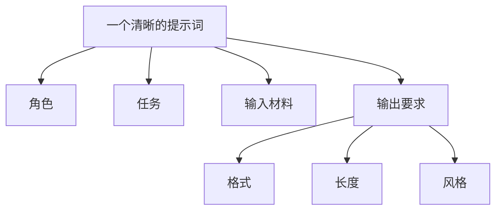

# 大模型与提示词基础

做 AI 应用开发时，你最先需要掌握的是两件事：大模型怎么工作，以及提示词为什么会直接影响结果。

## 什么是大模型

大模型可以理解为一种很强的“语言接口”。你给它输入文本，它根据训练中学到的模式，预测最合适的后续内容。

它擅长：

- 理解自然语言
- 生成文字内容
- 归纳、改写、分类
- 按要求输出固定格式

它不擅长：

- 保证百分之百正确
- 天然拥有最新知识
- 在没有上下文时理解你的真实意图

## 什么是提示词

提示词不只是“你问模型的一句话”，而是你给模型的任务说明书。

一个更有效的提示词，通常会包含这些信息：

- 角色：你希望模型扮演什么身份
- 任务：具体要完成什么
- 输入材料：模型可以参考哪些内容
- 输出要求：格式、长度、风格、限制条件

## 一个简单例子

普通问法：

> 帮我总结这篇文章。

更清晰的问法：

> 你是一名技术编辑。请基于下面的文章内容，输出 3 条核心观点，并用面向初学者的语言解释，每条不超过 80 字。

差别在于，第二种写法明确了角色、目标、受众和输出格式，因此结果更可控。

## 写提示词时常见的优化方法

### 明确任务边界

不要只说“写一下”，而要说清楚写什么、给谁看、输出成什么样。

### 提供上下文

如果用户问题依赖背景资料，就把资料一起给模型，而不是假设模型“应该知道”。

### 约束输出格式

当你需要程序继续处理结果时，尽量要求模型输出 Markdown、JSON 或固定字段。

### 给出示例

如果格式要求较复杂，示例往往比长篇说明更有效。

## 初学者常见误区

- 把提示词写得很长，但没有重点
- 只描述目标，不说明限制条件
- 想用一次提示词解决所有问题
- 结果不稳定时，只怪模型，不检查输入和上下文

## 实用建议

把提示词当成可以持续迭代的代码来维护。保存版本、记录效果、对比不同写法，长期来看会比“凭感觉调”高效很多。
