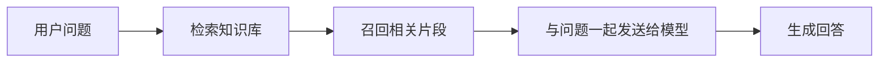
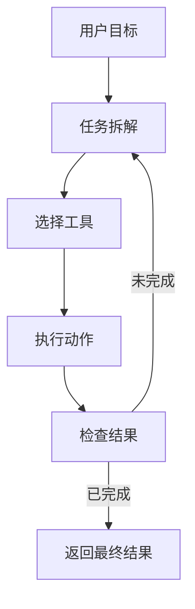
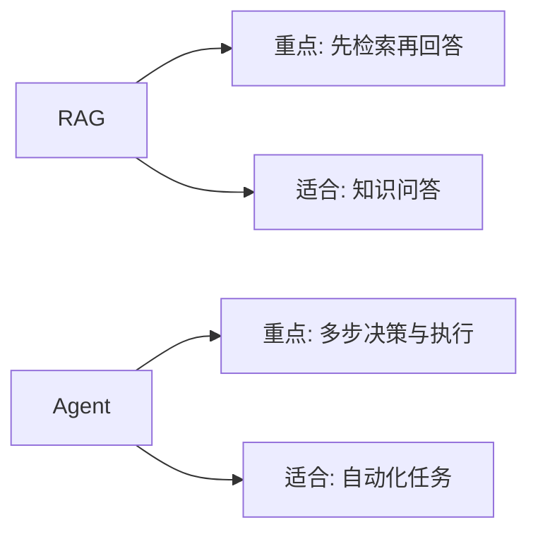

# RAG 与 Agent 入门

RAG 和 Agent 是 AI 应用开发里最容易被混在一起的两个概念，但它们解决的问题并不完全相同。

## 什么是 RAG

RAG 是 Retrieval-Augmented Generation，通常翻译为“检索增强生成”。

它的基本思路是：

1. 先从外部知识源中检索相关内容
2. 再把检索到的内容连同用户问题一起发给模型
3. 让模型基于这些材料生成回答

## RAG 适合什么场景

- 文档问答
- 企业知识库
- FAQ 助手
- 个人笔记检索
- 基于私有资料的内容生成

RAG 的重点是“先找资料，再回答”。

## 什么是 Agent

Agent 更像一个具备目标驱动能力的执行单元。它不仅能生成文本，还可能：

- 拆解任务
- 选择工具
- 调用接口
- 读取数据
- 根据结果继续下一步

Agent 的重点是“为了完成目标，做多步动作”。

## 两者的核心区别

RAG 主要解决“模型不知道最新或私有信息”的问题。

Agent 主要解决“任务不是一次回答，而是一连串动作”的问题。

## 一个直观例子

### 文档问答助手

用户问：“这份产品方案里 MVP 范围是什么？”

这更像 RAG 场景，因为系统要先去方案文档里找相关内容。

### 自动生成周报并发送邮件

系统要先读取任务记录，再总结，再生成周报，再发邮件。

这更像 Agent 场景，因为它涉及多步流程和工具调用。

## 初学者应该先学哪个

大多数情况下，先学 RAG 更合适。

因为很多“看起来需要 Agent”的需求，本质上只是：

- 有外部资料要查
- 需要结构化输出
- 需要少量流程编排

这时未必需要完整 Agent。

## 一个实用判断方法

如果你的系统主要是在“查资料后回答问题”，先做 RAG。

如果你的系统主要是在“为了达成目标连续执行多个动作”，再考虑 Agent。
