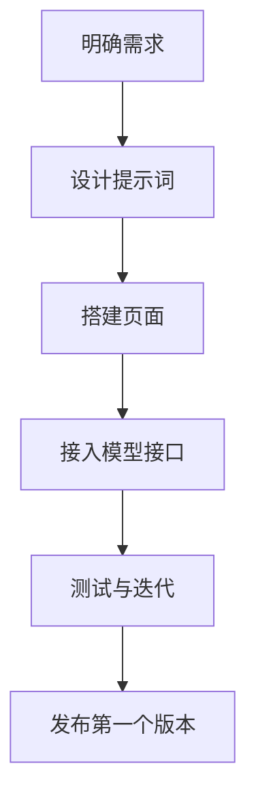
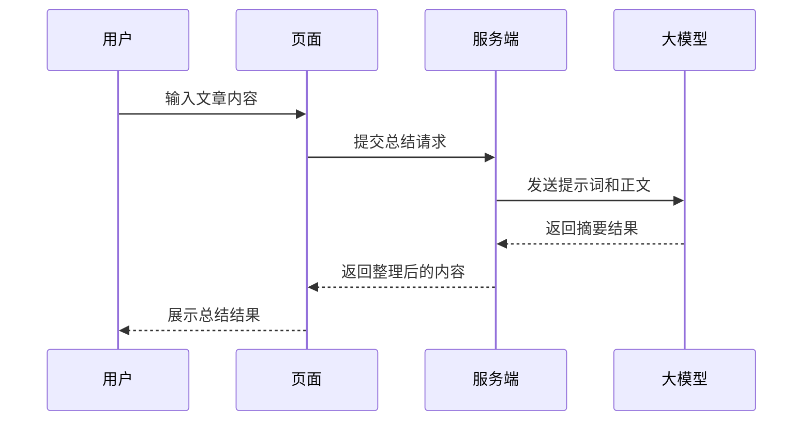

# 从 0 到 1 做一个 AI 小项目

如果你想把“学习 AI 应用开发”变成真正的作品，最好的办法是做一个小而完整的项目。

## 推荐项目：文章总结助手

这是一个很适合新手的题目，因为它同时覆盖了：

- 用户输入
- 模型调用
- 提示词设计
- 结果展示

## 最小版本应该包含什么

- 一个输入框，允许粘贴长文本
- 一个按钮，点击后调用模型
- 一个结果区，展示总结内容
- 一个简单提示词，用来约束输出格式

## 开发步骤

### 1. 明确需求

先把目标写清楚，例如：

“用户输入一段文章内容，系统输出 3 条要点和 1 段摘要。”

### 2. 设计提示词

例如：

> 请阅读下面内容，提炼 3 条核心要点，并给出一段不超过 120 字的摘要。输出使用 Markdown 列表。

### 3. 搭一个最简单的页面

不需要一开始就做漂亮 UI，先保证流程能通。

### 4. 接入模型接口

后端负责转发请求、保护密钥、处理错误。

### 5. 反复测试

重点观察：

- 输入长一点时效果如何
- 输出是否稳定
- 有没有跑题
- 结果是否足够简洁

## 做完后怎么继续升级

第一版完成后，可以继续加：

- 文章风格选择
- 多语言总结
- 输出为固定 JSON
- 保存历史记录
- 支持 URL 抓取正文

## 一个很重要的习惯

每做完一个版本，都记录三件事：

- 当前提示词是什么
- 效果最好的输入案例是什么
- 用户最不满意的问题是什么

这会帮助你从“写 demo”逐渐进入“做产品”的状态。
