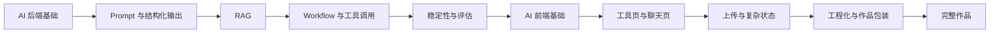
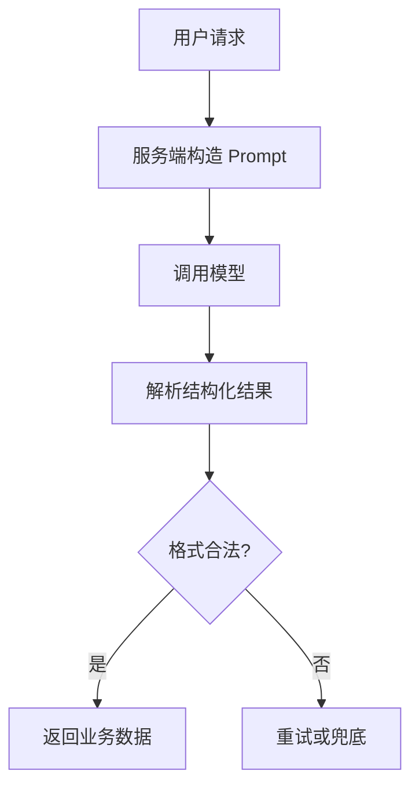
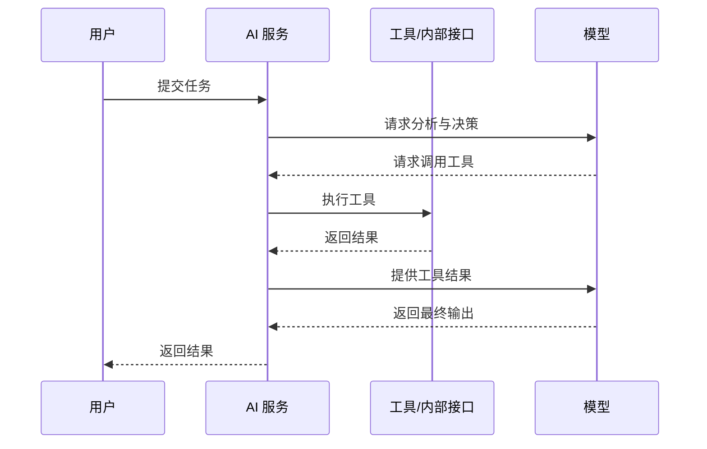
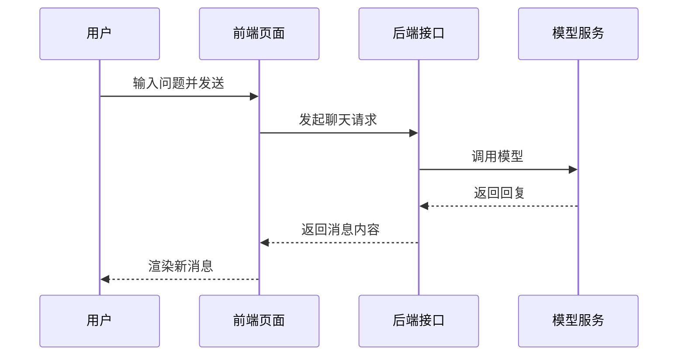
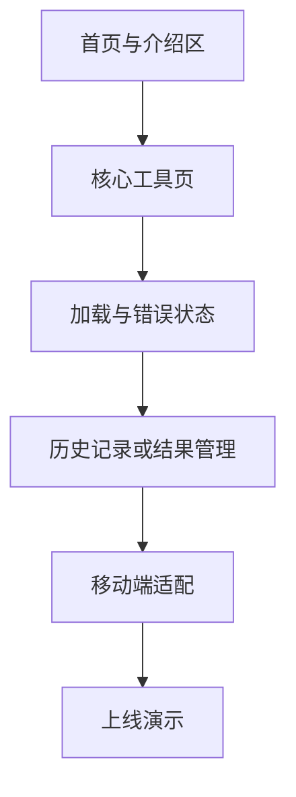

# 后端开发者转 AI 应用开发的完整学习路线

这是一份面向后端开发者的 AI 应用开发完整路线，目标不是把你培养成纯算法工程师或纯前端工程师，而是让你能独立做出一个前后端一体、可展示、可上线的 AI 作品。

整条路线分成两部分：

- 第一部分：AI 后端能力，解决“怎么把模型接进系统”
- 第二部分：AI 前端能力，解决“怎么把能力做成作品”

如果你的目标是做自己的作品、转向 AI 应用开发，或者逐步从传统后端走向 AI 工程，这份路线可以作为主线文档长期使用。

## 总体目标

完成这条路线后，你应该能做到：

- 独立完成 AI 后端接口与服务设计
- 独立完成 Prompt、结构化输出、RAG、工具调用这些关键能力
- 独立完成 AI 工具型前端页面
- 把前后端整合成一个可部署、可展示的小型 AI 产品

## 建议节奏

推荐按 24 周业余节奏推进：

- 前 12 周：AI 后端开发路线
- 后 12 周：AI 前端与作品路线

如果你时间更紧，也可以先完成后端部分，再按项目需要补前端。

## 第一部分：AI 后端学习路线

### 第 1 阶段：建立 AI 应用开发的工程认知

#### 第 1 周：先建立正确认知

你需要先搞清楚这些概念：

- LLM
- Token
- Context Window
- Prompt
- Embedding
- RAG
- Function Calling
- Agent

本周重点不是背定义，而是理解这些概念在真实系统里的职责边界。

本周输出物：

- 一份自己的 AI 应用工程认知图

验收标准：

- 你能用工程语言解释 Prompt、RAG、Tool Calling 和 Agent 的区别

#### 第 2 周：完成第一个模型调用接口

学习重点：

- 模型 API 调用
- 系统提示词
- 请求参数
- 超时处理
- 失败重试
- 日志记录

建议练习：

- 用熟悉的后端语言做一个文本总结接口
- 支持输入文本并返回摘要
- 补上超时、异常捕获和基本日志

本周输出物：

- 一个最小可运行的 AI 文本处理接口

### 第 2 阶段：把模型接入真正的后端流程

#### 第 3 周：学习 Prompt 设计的工程用法

学习重点：

- 角色设定
- 任务约束
- 输出格式要求
- Few-shot 示例
- Prompt 版本管理

本周输出物：

- 一组可复用的 Prompt 模板

#### 第 4 周：结构化输出与服务端校验

学习重点：

- JSON 输出
- 固定字段约束
- 字段校验
- 失败兜底
- 非法输出处理

本周输出物：

- 一个具备结构化输出能力的 AI 接口

### 第 3 阶段：进入 RAG，补足 AI 应用的核心能力

#### 第 5 周：理解 RAG 全链路

学习重点：

- 文档切分
- Embedding
- 向量检索
- Top-K 召回
- 上下文拼装
- 回答生成

本周输出物：

- 一份 RAG 流程图和调研笔记

#### 第 6 周：实现最小 RAG 服务

学习重点：

- 文件导入
- 文本切分
- 向量化
- 检索接口
- 问答接口

本周输出物：

- 一个最小可用的 RAG 服务

#### 第 7 周：调优 RAG 效果

学习重点：

- chunk 大小调整
- 检索条数调整
- 上下文长度控制
- Prompt 调整
- 基础评估集设计

本周输出物：

- 一份 RAG 调优记录

### 第 4 阶段：从单次回答走向 Workflow 和工具调用

#### 第 8 周：先学 Workflow，再学 Agent

学习重点：

- 任务拆分
- 多步骤流程编排
- 中间结果传递
- 步骤失败处理

本周输出物：

- 一个多步骤 AI 后端流程

#### 第 9 周：工具调用与轻量 Agent

学习重点：

- Function Calling
- 工具注册
- 参数校验
- 权限边界
- 工具结果回传

本周输出物：

- 一个带工具调用能力的 AI 服务

### 第 5 阶段：补齐 AI 后端的产品化能力

#### 第 10 周：稳定性、成本与安全

学习重点：

- 限流
- 并发控制
- 缓存
- 成本统计
- 敏感信息处理
- Prompt 注入风险
- 权限控制

本周输出物：

- 一份 AI 服务非功能需求清单

#### 第 11 周：评估、监控与可观测性

学习重点：

- Prompt 版本记录
- 输入输出审计
- 耗时统计
- Token 成本统计
- 错误率统计
- 人工评审机制

本周输出物：

- 一套 AI 接口评估与监控方案

#### 第 12 周：完成一个作品级 AI 后端项目

推荐题目：

- 企业知识库问答 API
- 内部文档助手
- 工单总结助手
- SQL 分析助手
- 代码审查助手

本周输出物：

- 一个可部署、可展示、可继续扩展的 AI 后端项目

## 第二部分：AI 前端学习路线

### 第 6 阶段：补齐做作品必需的前端基础

#### 第 13 周：页面结构与样式表达

学习重点：

- HTML 语义结构
- CSS 基础
- Flex 布局
- Grid 布局
- 表单、按钮、卡片、弹窗
- 响应式布局

本周输出物：

- 一个静态的 AI 工具首页

#### 第 14 周：浏览器交互基础

学习重点：

- DOM 操作
- 事件处理
- 表单提交
- 异步请求
- 加载状态
- 错误提示
- 空状态

本周输出物：

- 一个可调用后端 AI 接口的纯前端页

### 第 7 阶段：学习 AI 工具前端最核心的交互模式

#### 第 15 周：结果型工具页面

这一类页面很常见，比如：

- 文章总结
- 内容改写
- 文本分类
- 信息提取

学习重点：

- 输入区设计
- 参数区设计
- 提交区设计
- 结果区设计
- 复制按钮
- 历史记录区

本周输出物：

- 一个完整的单页 AI 工具原型

#### 第 16 周：聊天型工具页面

学习重点：

- 消息列表
- 用户与助手角色区分
- 打字中状态
- 自动滚动到底部
- 消息重试
- 输入框与发送逻辑

本周输出物：

- 一个基础聊天页面

### 第 8 阶段：补 AI 产品常见的复杂交互

#### 第 17 周：文件与知识库相关界面

学习重点：

- 文件上传
- 上传进度
- 文件列表
- 处理中状态
- 成功与失败提示
- 结果展示区

本周输出物：

- 一个“上传文档 -> 发起问答”的前端页

#### 第 18 周：多状态和异常处理

重点学习这些状态：

- loading
- empty
- error
- partial success
- timeout
- rate limit
- retry

本周输出物：

- 一套 AI 页面状态规范
- 一组可复用的基础状态组件设计

### 第 9 阶段：补齐前端工程化的最低必要能力

#### 第 19 周：现代前端开发流程

学习重点：

- 包管理
- 构建工具
- 环境变量
- 模块化
- 组件化
- API 请求封装

本周输出物：

- 一个结构清晰的小型前端项目

#### 第 20 周：路由、状态与复用

学习重点：

- 页面路由
- 基础状态管理
- 公共布局
- 通用组件
- 请求层复用

本周输出物：

- 一个包含首页、工具页、历史页的最小作品站

### 第 10 阶段：学习作品感，而不只是功能感

#### 第 21 周：界面审美与信息层次

学习重点：

- 排版
- 留白
- 配色
- 信息层级
- 卡片与区块组织
- 按钮主次关系

本周输出物：

- 一个经过视觉重构的 AI 工具页

#### 第 22 周：作品展示与用户体验

学习重点：

- 首页介绍区
- 项目说明
- 使用说明
- 示例展示
- 引导入口
- 首次使用体验

本周输出物：

- 一个能对外演示的个人作品首页

### 第 11 阶段：选定框架并做一个完整 AI 作品

#### 第 23 周：选框架落地

建议选择：

- 如果更重视上手速度和个人站结合：优先 Vue
- 如果更重视生态和未来复杂交互：优先 React

本周输出物：

- 一个基于框架重构后的 AI 工具页

#### 第 24 周：完成一个完整作品

推荐题目：

- AI 文档问答
- 文章总结助手
- Prompt 调试台
- SQL 解释助手
- 代码审查助手

页面要求：

- 有首页或介绍区
- 有核心交互页
- 有加载、错误、空状态
- 有基本的移动端响应式

本周输出物：

- 一个可部署、可展示、可放进简历或博客的 AI 作品

## 推荐执行顺序

如果你不想严格按周推进，也可以按下面的顺序做：

1. 先做一个模型调用接口
2. 再补 Prompt 和结构化输出
3. 再做一个最小 RAG
4. 再补 Workflow 和工具调用
5. 再补稳定性和评估
6. 再做一个前端工具页
7. 再补聊天、上传和复杂状态
8. 最后做首页包装和完整作品

## 最常见的坑

- 只会调用模型，却不会做服务设计
- 过早上复杂 Agent 框架
- 前端做得能用，但没有作品感
- 没有评估体系，只凭感觉调效果
- 把 demo 当成产品

## 学完后的能力边界

完成这条路线后，你应该可以：

- 独立完成 AI 后端服务设计与实现
- 独立完成 AI 工具型前端页面
- 独立做出一个前后端一体的 AI 作品

但这还不等于你已经覆盖了：

- 模型训练与微调
- 深度算法研究
- 大型前端架构设计
- 大规模分布式 AI 平台设计

这不是缺点，而是阶段目标不同。你当前最重要的，是把 AI 能力真正做成自己的系统和作品。
